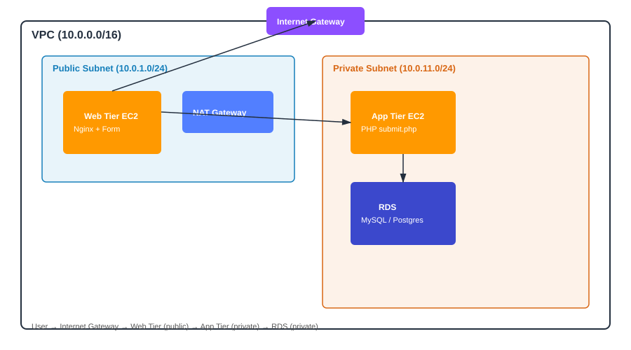

# Project 3: 3-Tier Infrastructure Deployment Using Terraform Modules

## 📌 Objective
Design and deploy a complete 3-tier web application architecture on AWS —
**Web (public) → App (private) → Database (private)** — using reusable
Terraform modules and Ansible for configuration automation.

## 🏗 Architecture


## 🛠 Tech Stack
`Terraform` · `Ansible` · `AWS VPC` · `EC2` · `RDS (MySQL)` · `Nginx` · `PHP`

---

## 🚀 Step-by-Step Guide

### Step 1: Networking (VPC Setup)
The [`terraform/modules/vpc`](terraform/modules/vpc) module creates:
- A custom VPC (`10.0.0.0/16`)
- 2 public + 2 private subnets across 2 Availability Zones
- Internet Gateway (public subnet) & NAT Gateway (private subnet)
- Route tables with correct associations
- Three security groups: `web-sg`, `app-sg`, `db-sg` (each only allows traffic
  from the tier in front of it)

```bash
cd terraform
terraform init
terraform plan
terraform apply
```

**✅ Deliverable:** Screenshot of the VPC, subnets, and route tables in the AWS Console.
📸 `screenshots/step1-vpc.png`

---

### Step 2: Web Tier (Public Subnet)
The [`terraform/modules/ec2`](terraform/modules/ec2) module launches the web EC2
instance in the public subnet. Configuration is applied via Ansible:
```bash
cd ansible
ansible-playbook -i inventory.ini web-tier.yml
```
This installs **Nginx** and deploys [`templates/registration.html.j2`](ansible/templates/registration.html.j2)
— a basic HTML registration form (Name, Email, Course).

**✅ Deliverable:** Screenshot of the registration form loading in a browser via the
web tier's public IP.
📸 `screenshots/step2-web-tier.png`

---

### Step 3: Application Tier (Private Subnet)
```bash
ansible-playbook -i inventory.ini app-tier.yml
```
This installs PHP + Apache and deploys [`templates/submit.php.j2`](ansible/templates/submit.php.j2),
which receives the form POST from the web tier and inserts the data into RDS.

**✅ Deliverable:** Screenshot of the app tier EC2 instance running (via SSH ProxyJump
through the web tier, since it has no public IP).
📸 `screenshots/step3-app-tier.png`

---

### Step 4: Database Tier (Private Subnet)
The [`terraform/modules/rds`](terraform/modules/rds) module provisions an RDS MySQL
instance in a **DB subnet group** made from the private subnets, with a security
group that only allows inbound `3306` from the app tier's security group.
Run [`ansible/db_schema.sql`](ansible/db_schema.sql) against it once to create the
`registrations` table:
```bash
mysql -h <rds_endpoint> -u admin -p appdb < ansible/db_schema.sql
```

**✅ Deliverable:** Screenshot of the RDS instance + its subnet group / security group.
📸 `screenshots/step4-rds.png`

---

### Step 5: End-to-End Test
1. Open the web tier's public IP in a browser.
2. Submit the registration form.
3. Confirm the row appears in the `registrations` table on RDS.

**✅ Deliverable:** Screenshot of a successful form submission + the matching row in MySQL.
📸 `screenshots/step5-end-to-end-test.png`

---

## 📂 Repository Structure
```
Project-3-3Tier-Terraform/
├── README.md
├── diagrams/
│   └── architecture.svg
├── terraform/
│   ├── main.tf / variables.tf / outputs.tf / terraform.tfvars.example
│   └── modules/
│       ├── vpc/
│       ├── ec2/
│       └── rds/
├── ansible/
│   ├── inventory.ini
│   ├── web-tier.yml
│   ├── app-tier.yml
│   ├── db_schema.sql
│   └── templates/
│       ├── registration.html.j2
│       ├── submit.php.j2
│       └── web_userdata.sh
└── screenshots/
```

## 🔧 How to Deploy
1. `cd terraform && cp terraform.tfvars.example terraform.tfvars` and fill in your
   `key_name` and a strong `db_password`.
2. `terraform init && terraform apply`
3. Update `ansible/inventory.ini` with the real public/private IPs from the
   Terraform output.
4. Run the two playbooks (`web-tier.yml`, `app-tier.yml`).
5. Load the site and test the registration form end to end.

## 🔐 Security Considerations
- App and DB tiers have **no public IPs** — only reachable through the VPC.
- Security groups are chained (`web → app → db`), not open to `0.0.0.0/0`.
- DB credentials should be moved to Secrets Manager for anything beyond a lab exercise.

## ✅ Deliverables Checklist
- [ ] Terraform code organized using modules (this repo)
- [ ] Ansible playbooks / provisioners (this repo)
- [ ] Architecture diagram (`diagrams/architecture.svg`)
- [ ] Code pushed to GitHub, link shared in documentation
- [ ] Screenshots / demo video of the working setup
- [ ] README with prerequisites, deploy steps, and how the system works (this file)
