**✅ Deliverable:** Screenshot of a successful Jenkins pipeline run (all stages green).
📸 `screenshots/11-jenkins-pipeline-success.png`

---

### Step 4: Lambda Function Integration
[`lambda/lambda_function.py`](lambda/lambda_function.py) logs each push to a
**DynamoDB** table (`ecr-push-log`) and optionally sends an **SNS** notification.

Trigger it either way:
- **Direct invoke** from the last Jenkinsfile stage (already wired up), or
- **EventBridge rule** — see [`lambda/eventbridge-rule.json`](lambda/eventbridge-rule.json),
  which matches ECR `PUSH` events for this repository.

Deploy:
```bash
cd lambda
pip install -r requirements.txt -t .
zip -r function.zip .
aws lambda create-function \
  --function-name ecr-push-notifier \
  --runtime python3.12 \
  --handler lambda_function.lambda_handler \
  --zip-file fileb://function.zip \
  --role arn:aws:iam::<account-id>:role/lambda-ecr-notifier-role \
  --environment "Variables={DYNAMODB_TABLE=ecr-push-log,SNS_TOPIC_ARN=<topic-arn>}"
```

**✅ Deliverable:** Screenshot of the Lambda test and CloudWatch logs.
📸 `screenshots/14-lambda-test-success.png`, `screenshots/17-cloudwatch-success.png`

---

### Step 5 (Optional Enhancements)
- Slack notification instead of/in addition to SNS.
- Trigger an ECS service update from Lambda after a successful push.

---

## 📂 Repository Structure
```
Project-4-Docker-ECR-Jenkins-Lambda/
├── README.md
├── Dockerfile
├── .dockerignore
├── Jenkinsfile
├── app/
│   ├── app.py
│   └── requirements.txt
├── lambda/
│   ├── lambda_function.py
│   ├── requirements.txt
│   └── eventbridge-rule.json
└── screenshots/
```

## 🔐 Security Considerations
- AWS credentials are stored in Jenkins' credentials manager, never hard-coded
  in the `Jenkinsfile`.
- The Lambda execution role should follow least privilege: only
  `dynamodb:PutItem` on the specific table and `sns:Publish` on the specific topic.
- ECR repository can have image scanning on push enabled for vulnerability checks.

## ✅ Deliverables Checklist
- [x] Jenkinsfile (this repo)
- [x] Dockerfile and source code (this repo)
- [x] Lambda function code (this repo)
- [ ] Code pushed to GitHub, link shared in documentation
- [x] README with architecture, deployment steps, and component explanation (this file)
- [x] Sample logs / screenshots of image push and Lambda execution

---

## 📸 Project Screenshots

### 1. Flask Application Running
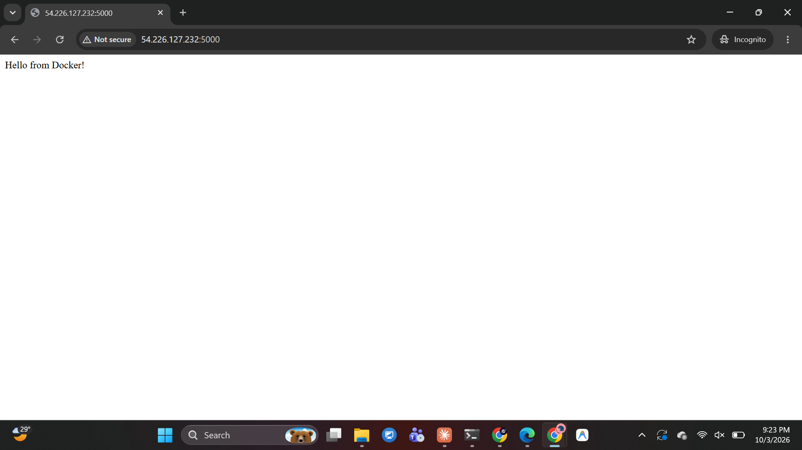

### 2. Docker Image Created
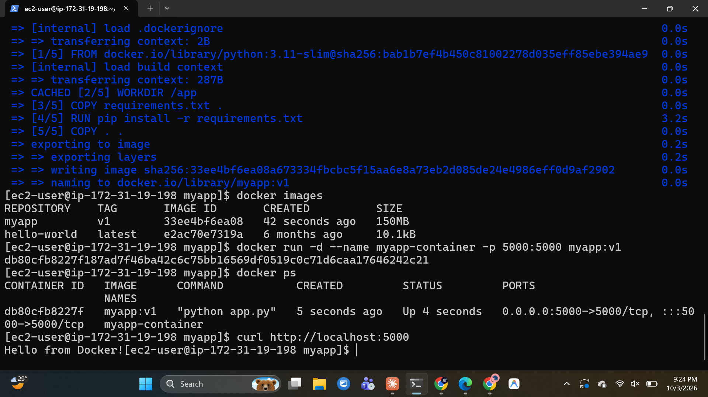

### 3. Amazon ECR Repository Created
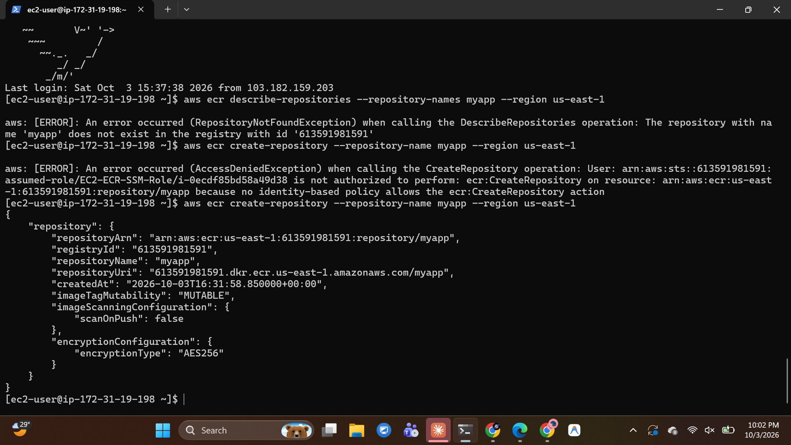

### 4. Docker Image Tagged for ECR
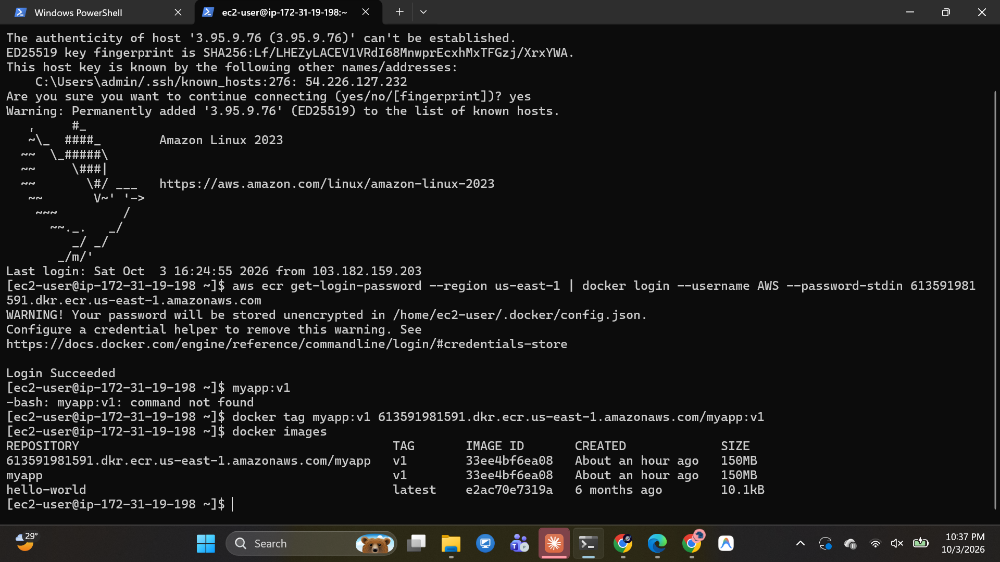

### 5. Docker Image Pushed to Amazon ECR
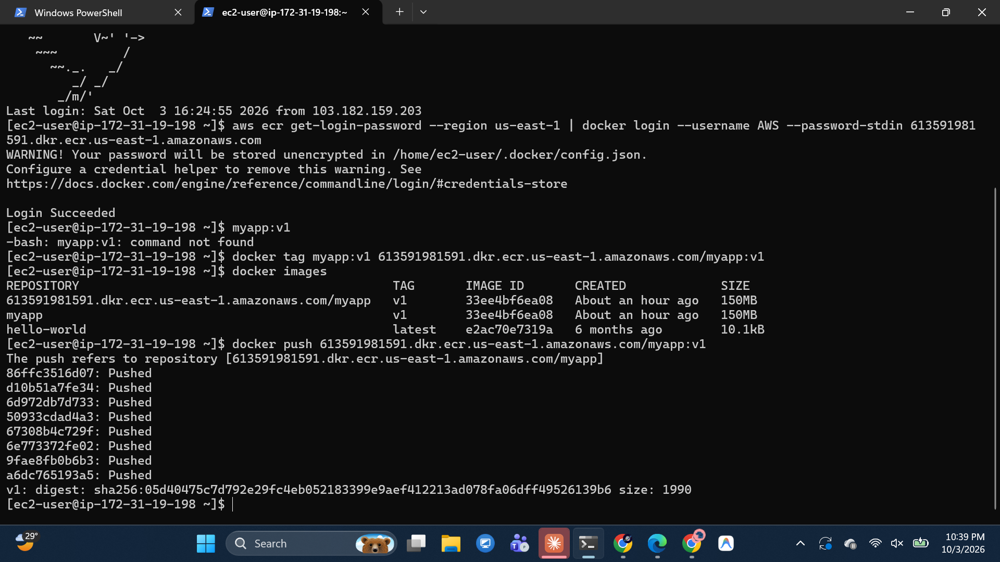

### 6. ECR Image Verified
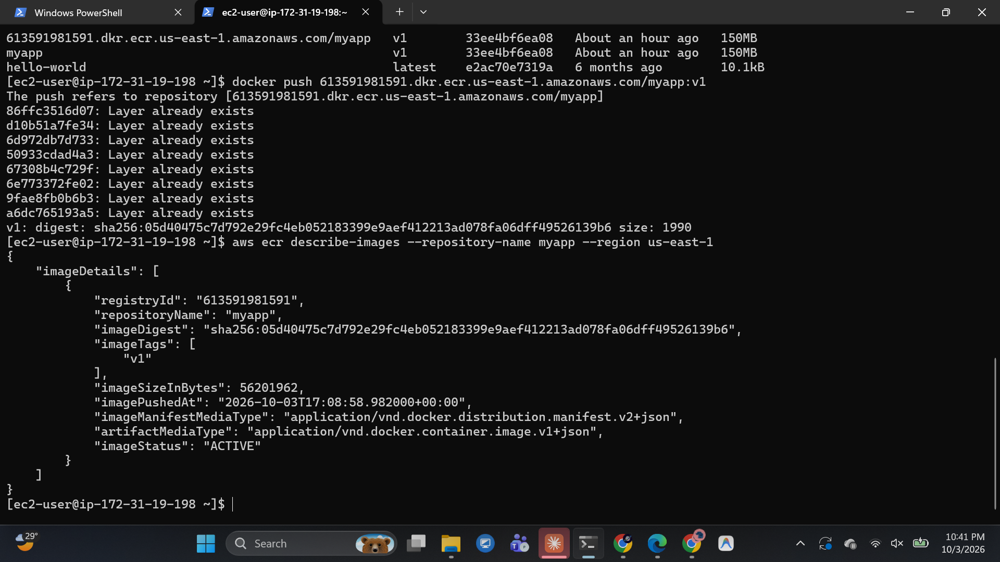

### 7. Jenkins Service Running
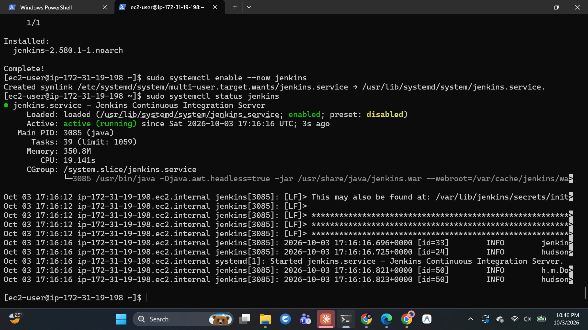

### 8. Jenkins Admin User Setup
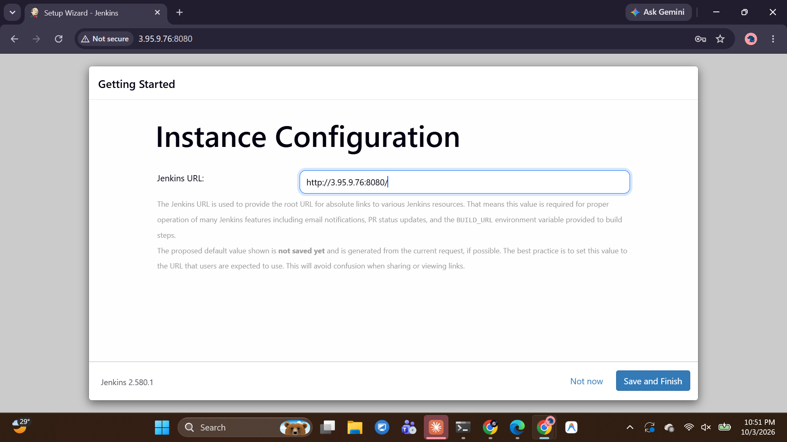

### 9. Jenkins Docker Access
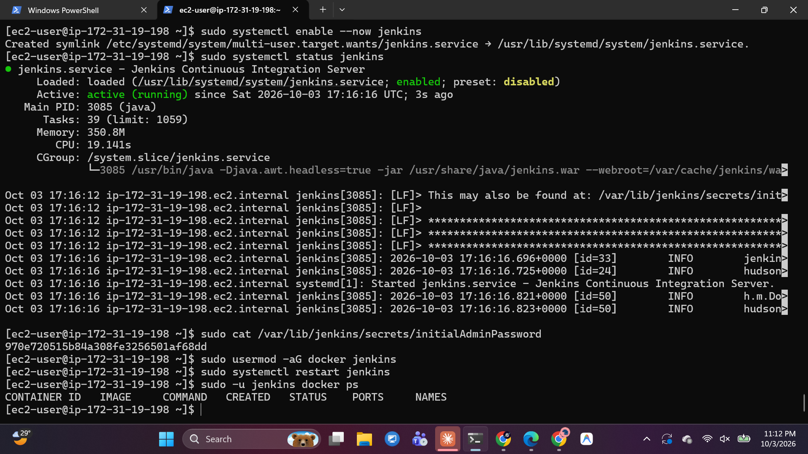

### 10. Jenkins GitHub SCM Configuration
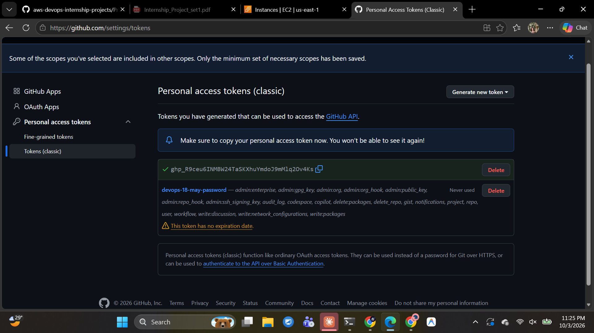

### 11. Jenkins Pipeline Successful
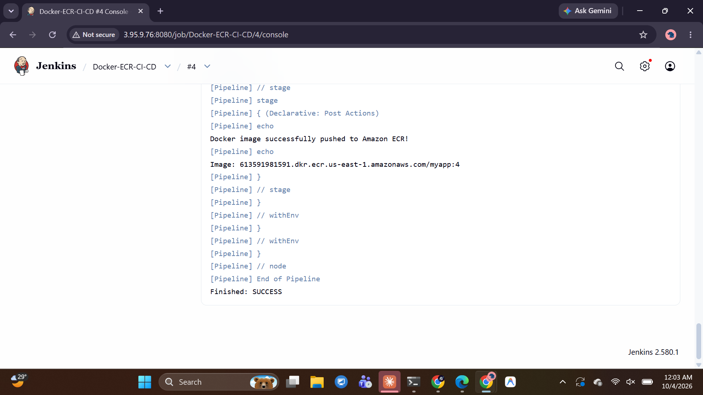

### 12. Jenkins ECR Test Successful
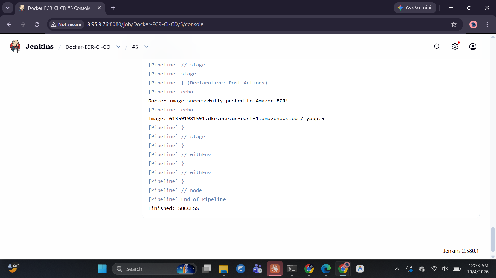

### 13. AWS Lambda Function Created
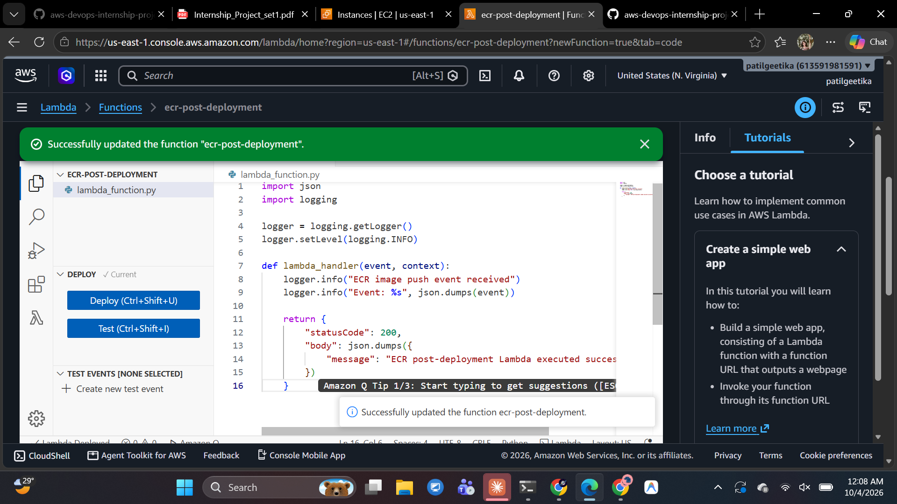

### 14. Lambda Test Successful
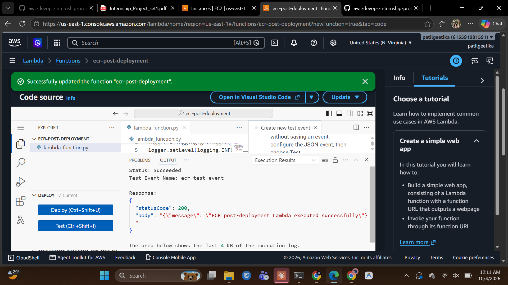

### 15. EventBridge Rule Created
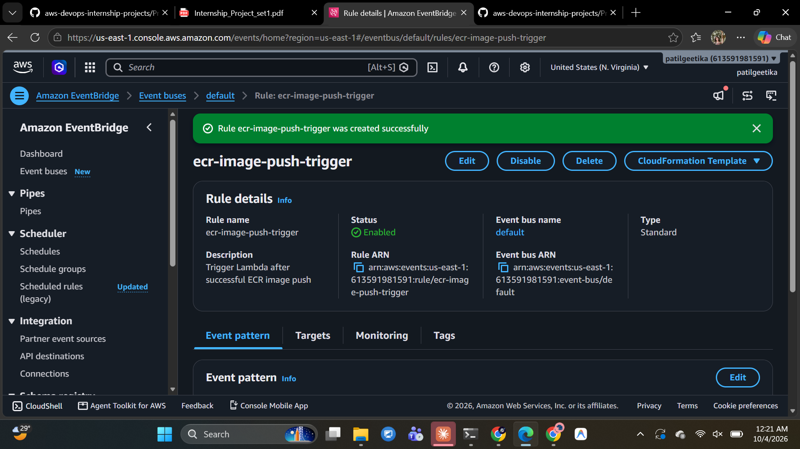

### 16. EventBridge Lambda Target Configured
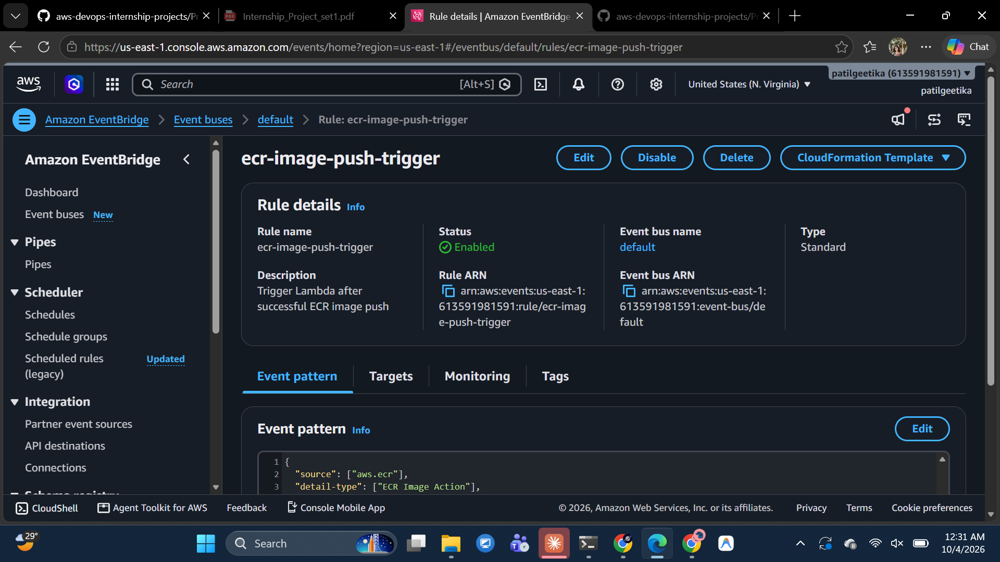

### 17. CloudWatch Logs Verified
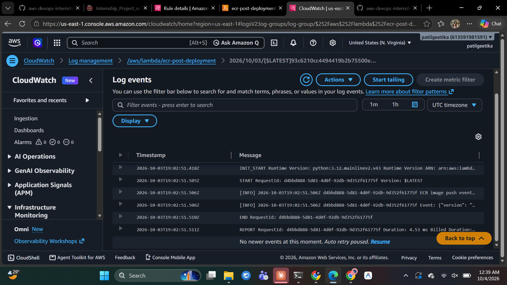
